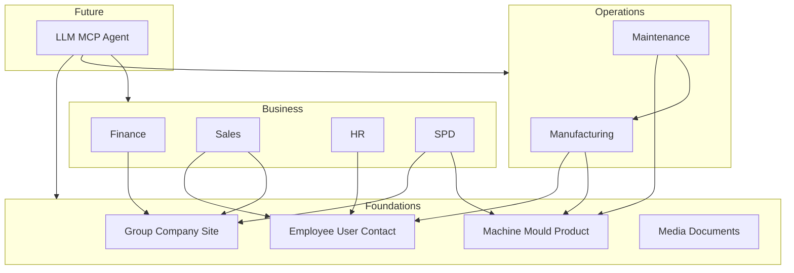

# Stanton / PIMMS Payload Ecosystem — Master Specification

**Version:** 0.2 (Phase 1 MVP reconciliation)  
**Last updated:** 2026-06-09  
**Repository:** `stanton` — Payload 3 + MongoDB (blank slate)

This document is the executive agreement for what we are building, how modules relate, and what principles govern modeling and delivery. Detailed collection inventories live in [module specs](./modules/). Glossary terms live in [CONTEXT.md](../CONTEXT.md).

---

## 1. Vision

Build a **single Payload CMS application** as the Stanton Group / PIMMS **operational and intelligence hub**: normalized data, admin-first UI, and a foundation for reporting, cross-module relationships, and future AI/MCP access.

Payload is the **source of truth for the ecosystem data model**, operational workflows, reporting records, and cross-module intelligence. External systems (Odoo, Pipedrive, SharePoint, payroll/HRIS, etc.) may originate or store data, but when data enters this ecosystem it is **normalized into Payload’s canonical model**. Domain-specific legal systems (e.g. Odoo for statutory accounting) may remain authoritative for legal records while Payload owns the ecosystem representation and reporting layer.

**Not in scope for this repo as primary deliverables:** Replacing Odoo accounting, full CRM, full HRIS, or standalone per-module apps. Report rendering (PPT/PDF decks) and stakeholder marketing sites are **downstream** consumers of Payload data.

---

## 2. Modules

| Module | Purpose | Delivery posture | Spec |
|--------|---------|------------------|------|
| **Foundations** | Shared org, people, customers, assets, files, tags, activity | Phase 0 — scope everything | [foundations.md](./modules/foundations.md) |
| **Manufacturing** | Real-time factory monitoring, operator input, OEE, planning | Phase 1b option (client choice) | [manufacturing.md](./modules/manufacturing.md) |
| **Maintenance** | Machine service, parts catalog, POs, triggers from Manufacturing | Phase 1b/2 (after Manufacturing) | [maintenance.md](./modules/maintenance.md) |
| **Finance** | Normalized finance reporting data (Odoo-shaped, Payload-owned) | Phase 1b option (client choice) | [finance.md](./modules/finance.md) |
| **SPD** | Product development waterfall, gates, change requests | **Phase 1a — POC (June 2026)** | [spd.md](./modules/spd.md) |
| **Sales** | Target / planned / actual performance by rep and team | Phase 2 | [sales.md](./modules/sales.md) |
| **HR** | Performance & organogram hub (not full HRIS) | Phase 2 — client deferred | [hr.md](./modules/hr.md) |
| **Internal LLM / MCP** | Future agent access over Payload data | Phase 3 | [llm-mcp.md](./modules/llm-mcp.md) |
| **Data Management** | Import/export, jobs, integrations (operational) | Cross-cutting | [data-management.md](./modules/data-management.md) |

### Integration map (conceptual)

---

## 3. Core principles

### 3.1 Payload-first modeling

- **Collections** hold business records and relationships.
- **Globals** hold module settings, thresholds, defaults, and template pointers — not large record sets.
- **Upload collections:** `media`, `documents` (and optionally `generated-reports` later).
- **Nested arrays/blocks** for owned substructure (checklists, report lines, template phases).
- **Nested Docs plugin** only for true same-collection trees (see [payload-data-model.md](./architecture/payload-data-model.md)).
- **Hooks + Jobs Queue** for automation; avoid generic notification/automation collections unless business users must edit rules in admin.

### 3.2 Model first, integrations later

Define Payload-native collections and manual/import paths first. Scope integrations (Odoo sync, Pipedrive, SharePoint filing, payroll) as **later feature sets** that conform to the Payload model — see [integrations.md](./architecture/integrations.md).

### 3.3 History and workflow

- **Master data** (Employee, Machine, Product, Company): current state records.
- **Operational/reporting facts**: snapshots, events, and history records — do not overwrite reporting facts.
- **Payload drafts** for content/templates where useful; **explicit status fields + transition events** for operational workflows (gates, jobs, reviews, imports).

### 3.4 Data entry

- Payload remains source of truth after import.
- **Import/Export plugin** for bulk CSV/JSON; Excel/planning sheets import into normalized Manufacturing (and other) records.
- Humans may manually enter or import from external exports until automated sync exists.

### 3.5 UI

- **Payload Admin** is the primary operational UI.
- **Custom admin views** for workflow-heavy screens (rounds, gates, review queues) — **deferred phase** after SPD POC and Manufacturing WhatsApp MVP; default Payload admin for Phase 1a/1b.
- **Stakeholder overview website** — client-facing executive site at `/` (and `/ecosystem`, `/modules`, `/roadmap`, `/investment`); omits implementation stack detail. **Team reference** at `/team` (not linked from client site; `robots: noindex`).

### 3.6 Access control

**Phase 1a skeleton:** `users.roles` (Admin / Staff minimum; Manager when matrix ships), optional `companyScope` relationship, hooks use `overrideAccess: false`. **Full matrix deferred:** manager/direct-report scopes, site/project team filters, module permissions — see [PHASE-1-MVP.md](./PHASE-1-MVP.md). LLM/MCP must inherit the same access model when implemented.

### 3.7 Prior builds

This repo is the **future canonical ecosystem**. Prior Manufacturing dashboard, HR PoC, and Odoo finance PoC are **reference only** — rebuild cleanly in Payload; selective data/concept import only.

---

## 4. SPD and ecosystem alignment

The SPD intake brief states a standalone app with no cross-platform integration. **Ecosystem decision:** SPD is a **bounded module** in the shared app with:

- Shared foundations (Employee, Company, Customer, Contact, Documents, Product/Tooling Asset where useful)
- **Versioned process templates** with **per-project snapshot**
- **First-class change requests** and **gate sign-off events**
- Phased cross-module links (e.g. Tooling Asset ↔ Product ↔ Mould) — not hard runtime dependencies on Manufacturing/HR/Finance for v1 POC

---

## 5. HR boundary

HR is a **performance and organogram hub**, not payroll/leave/recruitment/HRIS in v1. Scope follows the [PIMMS HR Platform brief](./intake/PIMMS%20HR%20Platform%20%E2%80%94%20Project%20Brief.md) for contracts, reviews, scorecards, and 1-on-1s — implemented Payload-native with **Contract Templates** collection and Employee-centered contract records.

---

## 6. Finance boundary

Payload stores **report-ready normalized finance data** (periods, sections, lines, metrics, aging, targets). Odoo remains accounting system of record. **Report generation** (PPT/PDF/board packs) is a downstream consumer of Payload API/data — not core collection design.

---

## 7. Internal LLM / MCP

No separate LLM data model. Store complete normalized data in Payload; later expose via API and [@payloadcms/plugin-mcp](https://payloadcms.com/docs/plugins/mcp) with per-collection permissions. Agent authenticates as a User (role TBD). See [llm-mcp.md](./modules/llm-mcp.md).

---

## 8. Documentation and delivery workflow

| Artifact | Role |
|----------|------|
| [docs/intake/](./intake/) | Immutable source briefs (redacted where needed) |
| [CONTEXT.md](../CONTEXT.md) | Glossary only |
| This file | Executive agreement |
| [docs/architecture/](./architecture/) | Modeling, integrations, costs |
| [docs/modules/](./modules/) | Module collection cards + evidence |
| [docs/PHASE-1-MVP.md](./PHASE-1-MVP.md) | Phase 1a/1b delivery plan (post-grill) |
| [docs/linear/scope-map.md](./linear/scope-map.md) | Linear hierarchy — **markdown only until epic approval** |

**Linear:** Markdown is canonical for product/spec. Create/update Linear issues **only after** scope map review and explicit approval. Operating rule: feature changes update relevant markdown and Linear together.

---

## 9. Operating costs (summary)

Internal/provider-facing estimates with vendor cost, client allowance, and markup notes — full detail in [operating-costs.md](./architecture/operating-costs.md). Not stored in Payload.

---

## 10. Delivery phases

| Phase | Focus |
|-------|--------|
| **0** | Documentation, glossary, intake archive, collection scope, Linear scope map |
| **1a** | Platform minimum + Foundations slice + **SPD POC** (June 2026) — see [PHASE-1-MVP.md](./PHASE-1-MVP.md) |
| **1b** | Client picks **one:** Finance data hub **or** Manufacturing WhatsApp MVP (not parallel) |
| **1.5** | Maintenance module, `activity-events`, custom admin views, remaining deferred Phase 1 items |
| **2** | Sales + HR performance workflows |
| **3** | Internal LLM/MCP + deeper integrations (Odoo sync, Pipedrive, SharePoint) |

All modules are **scoped in backlog** from Phase 0; implementation order follows [PHASE-1-MVP.md](./PHASE-1-MVP.md).

---

## 11. Open decisions (rollup)

| Topic | Status |
|-------|--------|
| Mould ↔ Product cardinality | Unresolved — needs client data |
| Access control matrix | Skeleton in 1a; full matrix deferred |
| Phase 1b module choice (Finance vs Manufacturing) | Client decision after SPD POC |
| Import/export governance per collection | Deferred — plugin-first |
| Payload admin collection grouping | Deferred (PLAT-008) |
| Finance full report list | Client confirmation pending per intake |
| Maintenance notification chains | TBD with client |
| Pipedrive field mapping | TBD before Sales build |
| Collection forks (one-on-one, finance sections, etc.) | Resolved — see [PHASE-1-MVP.md](./PHASE-1-MVP.md) |

---

## 12. References

- [Payload skill](../.agents/skills/payload/SKILL.md)
- Intake index: [docs/intake/README.md](./intake/README.md)
- Linear scope: [docs/linear/scope-map.md](./linear/scope-map.md)
