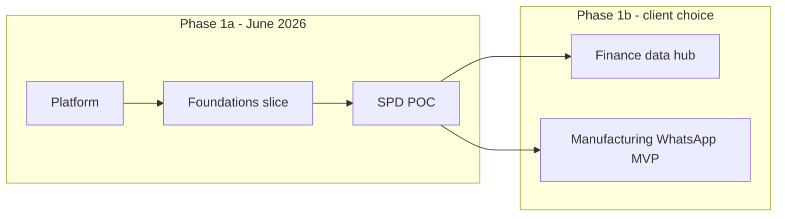

# Phase 1 MVP — Delivery Plan

**Status:** Agreed after dual-persona grill + reconciliation (2026-06-09)  
**Canonical references:** [MASTER-SPEC.md](./MASTER-SPEC.md), [reconciliation matrix](./reviews/reconciliation-matrix-2026-06-09.md)

Phase 1 is split into **1a** (ship SPD POC by end of June 2026) and **1b** (one operational module — Finance **or** Manufacturing — client choice after POC). This replaces the prior "everything in parallel" Phase 1 shape (~88 issues).

---

## Principles

1. **Intake is authoritative** — deferrals are **deferred phase**, not out of scope.
2. **≤3 parallel workstreams** in any slice: Platform, Foundations slice, one module epic.
3. **Default Payload admin** for v1 — custom views are deferred phase.
4. **No unresolved collection forks** in active slices (see reconciliation matrix).
5. **Access skeleton** in 1a (`users.roles`, optional `companyScope`); full matrix deferred.

---

## Phase 1a — SPD POC (target: end of June 2026)

### Ordered delivery

| Step | Deliverable | Issues (scope map) | Collections / artifacts |
|------|-------------|-------------------|-------------------------|
| 1 | Platform minimum | PLAT-001, 002, 003, 005, 006 | MongoDB replica set, Vercel, `users`, `documents`, import-export + cron |
| 2 | Foundations slice | FND-003, FND-004 (+ partial FND-001) | `companies`, `employees`, `customers`, `contacts` |
| 3 | SPD core | SPD-001–007 | `spd-process-templates`, `spd-projects`, `spd-gate-sign-offs`, `spd-change-requests`, `tooling-assets`, `spd-settings` |
| 4 | POC content | SPD-002 | Import SPD_ProcessFlow.docx → published template; 1–2 demo projects |
| 5 | Milestone gate | SPD-011 | Conrad POC review (~75% process accuracy) |

### Collections in 1a (complete list)

| Collection | Module | Notes |
|------------|--------|-------|
| `users` | Foundations | Roles: Admin, Staff (+ Manager when matrix ships) |
| `documents` | Foundations | Upload + metadata |
| `companies` | Foundations | Single seeded company OK for POC |
| `employees` | Foundations | Approvers link via users |
| `customers` | Foundations | SPD project customers |
| `contacts` | Foundations | Stakeholder contacts |
| `spd-process-templates` | SPD | Blocks: phases → stages → gates |
| `spd-projects` | SPD | Embedded `processSnapshot` at create |
| `spd-gate-sign-offs` | SPD | Append-only event records |
| `spd-change-requests` | SPD | In-scope / out-of-scope classification |
| `tooling-assets` | SPD | Minimal: name + version; CR links |
| `spd-settings` | SPD | Default template pointer |

### Explicitly NOT in 1a

| Item | Label | Intake ref (still in backlog) |
|------|-------|-------------------------------|
| Custom SPD dashboards | deferred phase | SPD brief — Dashboards Required |
| Client form endpoint | deferred phase | SPD brief — Client-facing forms |
| AI document validation | deferred phase | SPD brief — AI validation |
| `groups`, `sites`, `departments`, `teams` | deferred phase | HR organogram — Phase 2 |
| `products`, `machines`, `moulds` | deferred phase | Manufacturing brief |
| `tags`, `activity-events` | deferred phase | foundations.md |
| Nested Docs plugin | deferred phase | PLAT-004 |
| Full access matrix | deferred phase | HR brief — Role-Based Access |
| Finance, Manufacturing, Maintenance | Phase 1b / 2 | respective briefs |
| Odoo sync, PPT generator | deferred phase | Finance brief |
| LLM, Sales, HR, Stakeholder web | Phase 2–3 | MASTER-SPEC |

### 1a success criteria

- [ ] Published process template matches SPD_ProcessFlow.docx structure (~75%)
- [ ] Demo project progresses through at least one gate sign-off
- [ ] Change request can be created and linked to project/tooling asset
- [ ] Template update does **not** mutate in-flight project snapshot
- [ ] Conrad POC review completed (SPD-011)

---

## Phase 1b — Client picks one (July–September 2026 target)

**Not parallel:** Finance full epic **or** Manufacturing WhatsApp MVP — decided after SPD POC.

### Option A — Finance data hub

| Deliverable | Collections |
|-------------|-------------|
| Reporting periods with lock | `finance-reporting-periods` (`status: open \| locked`, `sections[]` blocks) |
| Normalized lines | `finance-report-lines` (`sectionKey`, `lineType` for aging) |
| Computed metrics | `financial-metrics` (recomputed when period open; frozen on lock) |
| Settings | `finance-settings` |
| CSV import | import-export plugin mapping |

**1b Finance minimum scope:** one company, one period, two sections (e.g. Profitability + Financial Metrics) to prove model before full eight report types.

**Deferred phase (Finance intake still applies):** PPT generation (FIN-007), scheduled email, Odoo sync (FIN-INT-*), remaining report types until client confirms (FIN-008).

### Option B — Manufacturing WhatsApp replacement

| Deliverable | Collections |
|-------------|-------------|
| Factory master (minimal) | `sites`, `machines`, `products`, `moulds` |
| Planning | `manufacturing-orders` + Excel import |
| Round entry | `production-snapshots` (`draft` → `submitted`, immutable after submit) |
| Settings | `manufacturing-settings` |

**Embedded on snapshots (not separate collections):** rejects, stoppage flag + reason. Mould `shotCount` increments on submit (warning at 15k — Maintenance module deferred).

**Deferred phase (Manufacturing intake still applies):** `planning-snapshots`, `stoppage-events` collection, notification jobs, `tool-change-events`, `quality-checklists`, `setter-sign-offs`, `one-on-one-scores`, custom tablet/TV admin views (MFG-009–010), Maintenance epic, CR 2026-06-01 features.

---

## Phase 1.5 / 2 backlog (deferred phase)

| Item | Trigger | Intake driver |
|------|---------|---------------|
| Maintenance module | After Manufacturing mould shots live | Maintenance brief |
| `one-on-one-scores` | Manufacturing path or HR green light | Mfg + HR briefs |
| `activity-events` | After polymorphic contract spec | foundations.md |
| Custom admin views | Post-POC / post-WhatsApp-MVP | SPD, Mfg briefs |
| Remaining Finance reports + PPT consumer | Finance path chosen | Finance brief |
| Odoo automated sync | Post data-hub validation | Finance brief |
| HR, Sales, LLM | MASTER-SPEC Phase 2–3 | respective briefs |
| Full org hierarchy + access matrix | Multi-module rollout | HR brief |

---

## Collection fork resolutions (locked)

| Topic | Decision |
|-------|----------|
| Finance sections | Blocks on `finance-reporting-periods`; `sectionKey` on lines |
| Rejects / stoppage (Mfg MVP) | Fields on `production-snapshots` |
| Maintenance parts | `partsUsed[]` array on `maintenance-jobs` |
| One-on-one scores | `one-on-one-scores` in Manufacturing when built; HR reads only |
| Performance contracts | Separate `performance-contracts` collection (HR Phase 2) |
| Sales rollups | Compute at read time; no `sales-performance-snapshots` until needed |
| SPD gate sign-offs | Separate append-only collection (both personas agree) |

---

## Workstream summary

**Parallel cap:** Platform + Foundations + SPD in 1a only. Phase 1b is a single module epic.

---

## Linear / implementation gate

Do **not** bulk-create ~88 Linear issues. Epic-level approval checklist:

- [ ] User approves Phase 1a scope (this document)
- [ ] User approves deferred labels on scope-map issues
- [ ] User approves epic structure before Linear MCP writes

**Start implementation after approval:** `PLAT-001` → `PLAT-006` → `FND-003`/`FND-004` → `SPD-001`+

---

## Related artifacts

| File | Role |
|------|------|
| [architect-grill-2026-06-09.md](./reviews/architect-grill-2026-06-09.md) | Integrity-focused grill |
| [pragmatist-grill-2026-06-09.md](./reviews/pragmatist-grill-2026-06-09.md) | Sequencing-focused grill |
| [reconciliation-matrix-2026-06-09.md](./reviews/reconciliation-matrix-2026-06-09.md) | Dispute resolutions |
| [scope-map.md](./linear/scope-map.md) | Trimmed issue labels |
| [adr/0001-finance-sections-on-period.md](./adr/0001-finance-sections-on-period.md) | Finance sections decision |
| [adr/0002-one-on-one-scores-manufacturing.md](./adr/0002-one-on-one-scores-manufacturing.md) | One-on-one canonical home |
