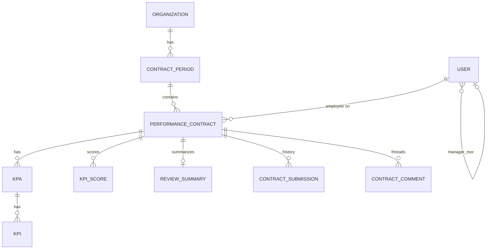

# Stanton Global — HR / People & Performance handoff

**Purpose:** Brief, platform-agnostic context for rebuilding the HR performance product elsewhere.  
**Audience:** A fresh agent or engineer who will redesign implementation, not port this repo verbatim.  
**Next session focus:** High-level overview of what was built, how it was planned, and how contracts/KPAs/KPIs fit together.

**Date:** 2026-06-04  
**Source repo:** `stanton-global` (see references below; do not treat this doc as a duplicate of those files).

---

## Executive summary

The HR workstream is a **proof-of-concept performance-management layer**, not a full HRIS. It targets **annual or half-year performance contracts**, weighted **KPAs** (Key Performance Areas) and **KPIs** (Key Performance Indicators) with SMART criteria, and a **review cycle** with manager and employee participation. Leadership gets an **operational dashboard** (coverage, overdue reviews, approvals); employees get a **narrower self-service view**.

**Strategic split:** The **data model and org/people structure** were designed as if for production; most **screens and workflows** are still **prototypes or demos** with fixture data. Read-only listing of people, contracts, and periods exists against a real database; **creating, approving, scoring, and notifying** are largely **not wired end-to-end**.

The same demo platform also hosts a **finance dashboard** (Odoo-backed). That is a separate product line; this handoff is **HR only**. See `docs/client-poc-overview.md` for the two-PoC picture and maturity comparison.

---

## What problem it solves

| Need | How the PoC addresses it |
|------|---------------------------|
| Agree goals for a period | Performance contract per employee per **contract period**, built from weighted KPAs/KPIs |
| Track planning vs review | Separate **planning status** (contract approval) and **review status** (review meetings, sign-off) |
| Line management | Users carry **manager** and **manager-once-removed (MOR)** links for hierarchy-aware UX |
| Org / tenant isolation | Multi-organisation membership; active org scopes data |
| Leadership visibility | Contracts hub: KPI strip, alerts, charts, attention queue, roster-style status table |
| Employee experience | Compact hero + stepper, personal KPIs, single “what to do next” queue |
| Future AI | KPI **embeddings** and **review summaries** (draft/published) in schema; UI hints only in PoC |

**Explicitly out of scope (PoC):** Payroll, leave, benefits, recruiting, external HRIS sync, email/calendar for review scheduling, production RBAC, audit-grade workflows.

---

## How it was planned (architecture of intent)

### 1. Schema-first, UI-second

The relational model was laid out **before** most write APIs and production UI binding. That signals intent: **contracts, periods, KPAs, KPIs, scores, submissions, comments, and review summaries** are the long-lived core; dashboards are **projections** over that core.

### 2. Two UX products on one domain

| Surface | Intent | PoC maturity |
|---------|--------|----------------|
| **People** | Org roster, analytics, manager queues by scope (direct / MOR / all), employee “my work” | **Prototype only** — stacked role previews, dummy rows, no real role enforcement |
| **Contracts** | Day-to-day ops: org KPIs, risk/alerts, charts, attention queue, employee status grid | **Mixed** — rich UI; much data from **fixtures**; period filter and some list reads can be real |
| **Create contract** | KPA/KPI builder: nested areas, SMART fields, **100% weight rules** at KPA and KPI level | **Form + validation demo** — submit does not persist full lifecycle to backend |
| **Calendar** | Review scheduling | **Stub** — not built |

### 3. Role-based views without role-based security (yet)

Four **experience prototypes** were designed in parallel and shown as **stacked sections** on one page (not gated by login role):

- **Owner / org admin** — org-wide metrics and full employee status table  
- **Manager** — queue-first; scopes: Direct, MOR, All  
- **Manager once removed** — escalations and rollups  
- **Employee** — personal contract progress, reduced chrome  

**Rebuild implication:** Implement real authorization (org role, manager chain, self-only) instead of copying the “prototype sections” pattern.

### 4. Dashboard contract as a product API (planned shape)

UI types describe a future **`dashboard.*`** surface (KPIs, alerts, attention queue, employee status rows, chart series, employee personal summary). Fixtures match those shapes today so screens can be built **before** aggregation endpoints exist.

Key dashboard KPI concepts (org level): headcount, contract counts, **coverage %**, **approved %**, **reviews signed off %**, average score, overdue reviews, due this week, pending approval, needs changes, outstanding-rated count, at-risk count.

### 5. Multi-organisation tenancy

Users belong to organisations; the **active organisation** scopes contracts and people lists. Rebuild should preserve **tenant boundary** on every contract and period.

---

## Domain model (conceptual)

### Contract period

Time box (e.g. FY2026 H1) for planning and review.  
**Statuses:** draft → open → locked → archived (controls whether edits/reviews are allowed).

### Performance contract

One per **employee** per **period** per **organisation** (unique constraint).  
**Planning status:** draft → submitted → approved | rejected | needs_changes.  
**Review status:** not_started → scheduled → employee_review → manager_review → completed → signed_off.  
**Outcomes:** optional total weighted score, performance rating band, employee/manager sign timestamps, review due/scheduled dates.

**Rating bands (enum):** Outstanding, Good, Adequate, Needs Improvement, Poor.

### KPA / KPI structure

- **KPA:** titled area with **weight %**; KPI weights within a KPA must sum to **100%**.  
- **KPI:** title, description, five SMART text fields, optional measurable outcome, optional weight %, optional **embedding** vector (for similarity / AI later).  
- **Scores (review phase):** per KPI — employee score, manager score, final agreed score, comments.

### People master (minimal HR)

On each user: **employee number**, **job** (title/role entity), **manager**, **manager MOR**. Not a full HR master — enough for roster, reporting lines, and dashboard rows.

### Review summary (AI-ready)

Per contract: draft text, recommended actions (JSON list), generated/published timestamps. UI mock rows reference `aiSummaryStatus` (draft / published / null).

---

## KPIs: two meanings

Avoid conflating these when rebuilding:

| Term in this product | Meaning |
|----------------------|---------|
| **KPI (indicator)** | A measurable goal row under a KPA on a performance contract |
| **Dashboard KPIs** | Aggregated **metrics** on the contracts home page (counts, percentages, overdue, etc.) |

**Dashboard KPI strip** is the leadership “pulse” — not the same as individual KPI rows in a contract form.

---

## Contracts hub — how it is meant to work

1. **Period filter** — slice all widgets to a contract period (or all periods).  
2. **KPI strip** — org-level operational metrics.  
3. **Alerts** — actionable groupings (severity, count, CTA label).  
4. **Charts** — distribution / trend series (planning status, review status, ratings, etc.).  
5. **Attention queue** — prioritized rows (P0–P6) by employee/manager with planning + review state and due dates.  
6. **Employee status table** — one row per performance contract: identity, job, manager, planning/review status, SMART completion %, scores/ratings, AI summary status.

**Employee dashboard (same product, different layout):** hero card with **stepper** (planning → review → sign-off), personal KPI subset, alerts, one queue item — no org-wide charts/table.

---

## Create-contract workflow (planned behavior)

1. Employee (or delegate) defines **KPAs** and nested **KPIs**.  
2. Validation enforces **KPA weights = 100%** and **KPI weights per KPA = 100%**.  
3. SMART fields captured per KPI for quality/completeness tracking (UI also tracks **SMART %** on status rows).  
4. Submit for manager approval → iterate (needs_changes) → approved.  
5. Later: review scheduling, dual scoring, agreed scores, rating, sign-off, optional AI review summary.

**PoC gap:** Steps 1–4 are demonstrated in the form; persistence, approval APIs, and notifications are not production-complete.

---

## What is actually live vs prototype

| Capability | Status |
|------------|--------|
| Auth + org switching | Working (demo sandbox labelled in UI) |
| DB schema for full performance domain | Migrated / designed |
| List people (roster + manager/job) | Read API, org-scoped |
| List contracts + period | Read API, org-scoped, optional period filter |
| List contract periods | Read API |
| Dashboard aggregates, attention queue, charts | **Fixture-driven** in UI |
| People page analytics/queues | **Dummy data** |
| Create/save/submit/approve contract | **Not complete** |
| KPI scoring, sign-off, submissions history | Schema only / not fully exposed |
| HRIS import, email, calendar | Not started |
| Real RBAC by role | Not implemented (prototype stacking only) |

---

## Integrations and production gap (HR)

| Integration | PoC | Production direction |
|-------------|-----|----------------------|
| Employee source of truth | Local DB users | HRIS sync (PaySpace, Sage, etc.) for master data and hierarchy |
| Notifications | None | Email / in-app for due reviews, approvals |
| Calendar | Stub route | ICS / Outlook / Google for scheduled reviews |
| SSO | Pluggable auth | Client IdP |
| AI | Schema + UI placeholders | KPI drafting, review summaries using embeddings |

Detailed gap list and retainer narrative: `docs/client-poc-overview.md` (§ HR production, § side-by-side maturity).

---

## Rebuild guidance (platform-agnostic)

1. **Keep the domain boundaries:** Period → Contract → KPA → KPI → Scores; separate planning status from review status.  
2. **Implement authorization early:** Owner, manager (direct reports), MOR (skip-level), employee (self), scoped by active org.  
3. **Replace fixtures with one dashboard read model** matching the shapes already sketched in UI types (or simplify aggregates if over-scoped).  
4. **Enforce weight invariants server-side**, not only in forms.  
5. **Treat embeddings and review summaries as optional phase-2** after core lifecycle works.  
6. **Do not expand into HRIS** unless scope changes — this product is the performance layer on top of org structure.

---

## Key references in repo

| Document / area | Path |
|-----------------|------|
| Client-facing PoC overview (HR + finance) | `docs/client-poc-overview.md` |
| Finance glossary only (not HR) | `CONTEXT.md` |
| Performance DB schema | `packages/db/src/schema/performance.ts` |
| User hierarchy fields | `packages/db/src/schema/auth.ts` |
| Dashboard / row type definitions (target API shapes) | `apps/web/src/components/contracts/types.ts` |
| Contracts hub UI composition | `apps/web/src/components/contracts/contracts-overview.tsx` |
| People role prototypes | `apps/web/src/routes/people.tsx` |
| KPA/KPI builder + validation rules | `apps/web/src/routes/contracts.create.index.tsx` |

---

## Suggested skills (for the next agent)

Invoke these when continuing work — especially on a **rebuild** or **production hardening** path:

| Skill | When to use |
|-------|-------------|
| `grill-with-docs` | Stress-test rebuild decisions; update `CONTEXT.md` or ADRs with domain terms and boundaries |
| `handoff` | If this session needs to be compacted again for another agent |
| `organization-best-practices` | Multi-tenant orgs, roles, invitations if using Better Auth again |
| `better-auth-best-practices` / `create-auth-skill` | Re-implementing auth and org switching |
| `neon-postgres` | If Postgres remains the datastore |
| `vercel-composition-patterns` | Redesigning role-specific dashboards without boolean-prop sprawl |
| `web-design-guidelines` | Accessibility/UX pass on rebuilt screens |
| `ai-sdk` | Only if implementing KPI drafting or review-summary generation |

**Intentionally omit for this handoff’s next step:** monorepo/turborepo, RPC, React Query, and stack-specific package skills — per request, stay at executive/domain level unless implementation starts.

---

## Sensitive data

No credentials or PII are recorded in this document. Environment-specific secrets and Odoo connection details live only in server env examples in the repo; redact if copying env templates elsewhere.
