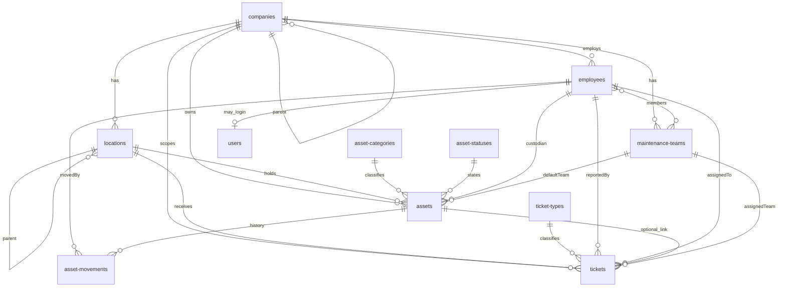
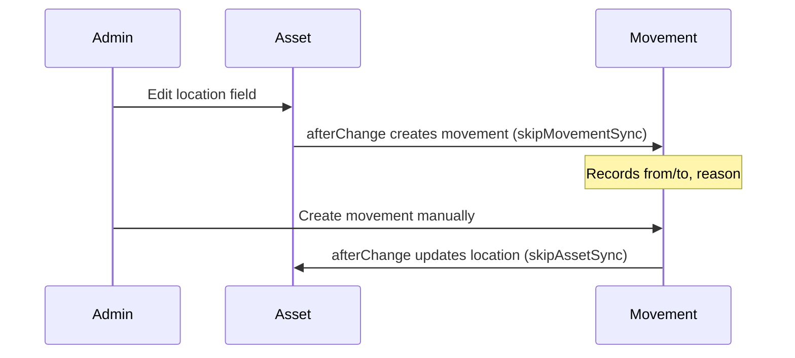
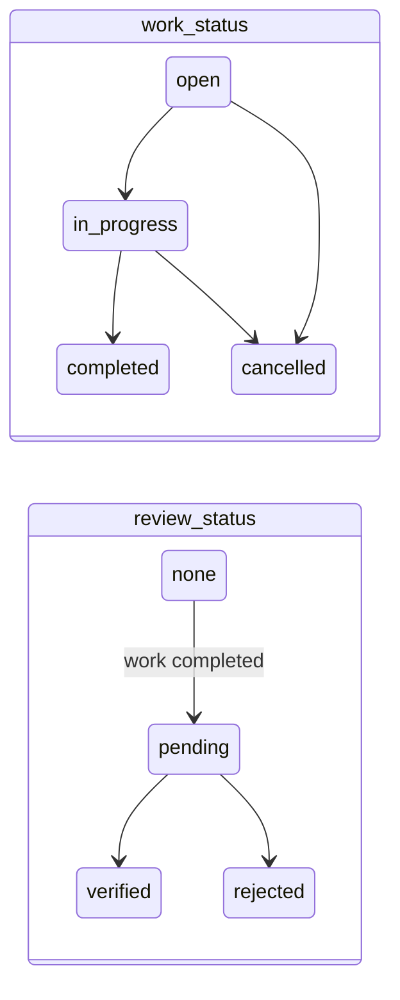

# Architecture

Module layout and integration patterns for the Stanton MVP Payload backend.

## Source layout

```
src/
├── collections/
│   ├── index.ts                 # All MVP collections export array
│   ├── media.ts
│   ├── organization/
│   │   ├── companies.ts
│   │   └── locations.ts
│   ├── catalog/
│   │   ├── asset-categories.ts
│   │   ├── asset-statuses.ts
│   │   └── ticket-types.ts
│   ├── people/
│   │   ├── employees.ts
│   │   ├── maintenance-teams.ts
│   │   └── users.ts
│   ├── assets/
│   │   ├── assets.ts
│   │   └── asset-movements.ts
│   └── maintenance/
│       └── tickets.ts
├── hooks/
│   ├── locations/
│   ├── assets/
│   ├── asset-movements/
│   └── tickets/
├── access/
│   ├── authenticated.ts
│   └── roles.ts
├── lib/
│   ├── constants/
│   │   ├── ticketStatuses.ts
│   │   ├── ticketReviewStatuses.ts
│   │   ├── ticketPriorities.ts
│   │   ├── activityKinds.ts
│   │   ├── userRoles.ts
│   │   └── sync-context.ts
│   └── relationships.ts
└── payload.config.ts
```

## Entity diagram



## Asset movement flow



**Loop prevention:** `req.context.skipAssetSync` and `req.context.skipMovementSync` flags ensure each direction fires only once.

## Ticket lifecycle



When `status` transitions to `completed`, `reviewStatus` becomes `pending` and a `completion` activity entry is appended.

## Access control (MVP)

| Rule | Implementation |
|------|----------------|
| Unauthenticated | No access to domain collections |
| Authenticated | Full CRUD on all MVP collections |
| Future RBAC | `users.role` stored with `saveToJWT`; helpers in `access/roles.ts` |

Strict per-role matrix documented as **future** — pending client confirmation on company-scoped visibility.

## Website template collections

`Pages`, `Posts`, `Categories` remain in the repo but are **not registered** in `payload.config.ts` for the MVP backend.
